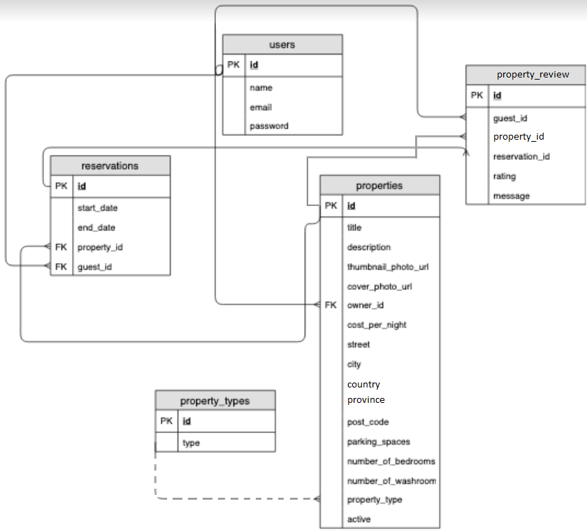

# ERD
## Diagram

## ERD Info
- _`users`_
  - `id`: Primary Key
  - `name`
  - `email`
  - `password`
  
- _`property_types`_
  - `id`: Primary Key
  - `type`

- _`properties`_
  - `id`: Primary Key
  - `title`
  - `description`
  - `thumbnail_photo_url`
  - `cover_photo_url`  
  - `owner_id` : Foreign Key _`users(id)`_
  - `cost_per_night`
  - `country`
  - `street`
  - `city`
  - `province`
  - `postal_code`
  - `parking_spaces`
  - `number_of_bedrooms`
  - `number_of_washrooms`
  - `property_type` : Optional, defaults to `1`, in future may references _`property_types(id)`_
  - `active`

- _`reservations`_
  - `id`: Primary Key
  - `start_date`
  - `end_date`
  - `property_id` : Foreign Key _`properties(id)`_
  - `guset_id` : Foreign Key _`users_id(id)`_

- _`property_reviews`_
  - `id`: Primary Key
  - `guest_id` : Foreign Key _`users(id)`_
  - `property_id` : Foreign Key _`properties(id)`_
  - `reservation_id` : Foreign Key _`reservations(id)`_
  - `message`
  - `rating`


# Migrations
## [schema.sql](migrations/schema.sql)
Creates database `lightbnb` and switches to it.

# Queries
## [getUserByEmail.sql](queries/getUserByEmail.sql)
Selects _id, name, email & password_ of a given user; here 'tristanjacobs@gmail.com'.
```bash
 id |     name      |          email          |   password
----+---------------+-------------------------+--------------
  1 | Devin Sanders | tristanjacobs@gmail.com |  $2a$10$FB...
(1 row)
```

averageLengthOfReservations
## [averageLengthOfReservations.sql](queries/averageLengthOfReservations.sql)
Selects the average duration of all reservations.
```bash
  average_duration   
---------------------
 14.6636000000000000
(1 row)
```

## [listingsByCity.sql](queries/listingsByCity.sql)
Shows all details about properties located in Vancouver including their average rating.


```bash
 id  |       title        | cost_per_night |   average_rating   
-----+--------------------+----------------+--------------------
 224 | Nature bite        |          10526 | 4.1000000000000000
 197 | Build they         |          34822 | 4.1000000000000000
  47 | Aside age          |          35421 | 4.2500000000000000
 149 | Present television |          53062 | 4.2222222222222222
(4 rows)
```
## [listingsByCity.sql](queries/listingsByCity.sql)
Shows all details about properties located in _Vancouver_ including their average rating.
- Selects all columns from the properties table for properties located in _Vancouver_, and the average rating for each property.
- Orders the results from lowest cost_per_night to highest cost_per_night.
- Limits the number of results to 10.
- Only shows listings that have a rating >= 4 stars.


## [mostVisitedCities.sql](queries/mostVisitedCities.sql)
Gets a list of the most visited cities.
Selects the name of the city and the number of reservations for that city.
```bash
       city        | total_reservations 
-------------------+--------------------
 Carcross          |                405
 Town of Hay River |                379
 Whitehorse        |                376
 Town of Inuvik    |                298
 (251 rows)
```

## [allMyPastReservations.sql](queries/allMyPastReservations.sql)
Shows all past reservations for a user; in this case user with `users.id = 1`.
- Selects all columns from the 
    - reservations table,
    - properties table
    and the average rating of the property.
- Orders the results from most recentto least recent.
- Limits the results to 10.
